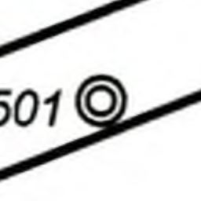
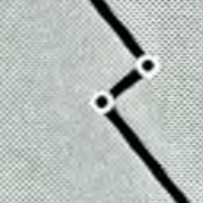
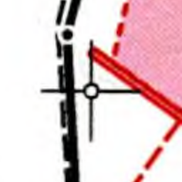
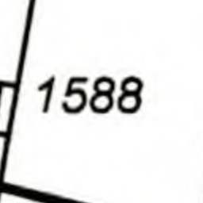

# Cadasym

Cadasym is a corpus for Computer Vision of symbols in cadastral maps.

Whenever a Swiss parcel or building changes its geometry, land surveyors
are required to submit a so-called “mutation plan” to the local authorities.
Today, this is done in a completely digital workflow, but for most of the
the 20th century the plans weree submitted on paper. By analyzing the
archived plans, we would like to eventually reconstruct the history
of cities and villages were built over time.

To build this corpus, we wrote an ad-hoc [desktop application](./corpus_builder)
that extracts image snippet from scanned plans of the City of Zürich. Human users
manually classified the image snippets into one of the categories shown below.

To download the corpus data, see [Releases](https://github.com/brawer/cadasym/releases/).

## Structure

The [released ZIP file](https://github.com/brawer/cadasym/releases/) contains
lots of PNG images. Each image is 256×256 pixel in size. The symbol in question
is alwayus located at the exact center of the image. Quite often, there are
other symbols nearby, or there is an overlapping line — that is exactly what
makes this an interesting problem. The PNG files are currently in one of these
folders:

| Category              | Sample                                                                                                              |
| --------------------- | ------------------------------------------------------------------------------------------------------------------- |
| `white_circle`        |                |
| `double_white_circle` |  |
| `black_dot`           |                      |
| `large_cross`         |                  |
| `other`               |                              |

Note: We’ll likely split the `white_circle` category by circle size. But this is rather trivial for a computer (we can just measure
the circle radius), so we’ll do this later. Also, we’ll likely add more categories over time.

## License

To the extent possible under law, we have waived all copyright
and related or neighboring rights to this work. This work is published
from Switzerland.

