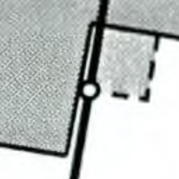

# Cadasym

Cadasym is a corpus for Computer Vision on symbols in cadastral maps.

**Background:** Whenever a Swiss parcel or building changes its
geometry, land surveyors are required to submit a so-called “mutation
plan” to the local authorities.  Today, this is done in a completely
digital workflow, but for most of the 20th century, plans were
submitted on paper. By analyzing the archived plans, we would like to
eventually reconstruct the history how buildings have developed over
time. At the moment, the images in the corpus were all taken from
cadastral mutation plans supplied by the [City of
Zürich](https://www.stadt-zuerich.ch/ted/de/index/geoz.html). In other
Swiss municipalities, the plans should look identical, but they will
likely not have used the same equipment for scanning paper plans to
electronic images.

**Purpose:** The images from this corpus are useful for testing,
evaluating and training computer vision systems. The symbol
recognition task appears ideal for training Convolutional Neural
Networks with synthetic training data; or maybe it’s enough to go with
“old-school” algorithmic computer vision.  Whatever solution we end up
using, we’ll need to evaluate its quality.

**Corpus building:** To build the corpus, we wrote an ad-hoc [desktop
application](./corpus_builder) that extracts image snippet from
scanned plans. Human users manually classified the image snippets into
one of the categories shown below.

**Data download:** To download the corpus data, see the ZIP file
in [Releases](https://github.com/brawer/cadasym/releases/).

## Structure

The [released ZIP file](https://github.com/brawer/cadasym/releases/) contains
PNG images, 256×256 pixel in size, where the symbol in question
is located at the exact **center of the image.** Quite often, there are
other symbols drawn nearby, or there is an overlapping line. That complication
is what makes this an interesting problem. The PNG files are currently in one of these
folders:

| Category              | Sample                                                                                                              |
| --------------------- | ------------------------------------------------------------------------------------------------------------------- |
| `white_circle`        |                |
| `double_white_circle` |  |
| `black_dot`           |                      |
| `double_black_circle` |  |
| `small_cross`         |                  |
| `large_cross`         |                  |
| `triangle`            |                  |
| `other`               |                              |

Note: We’ll likely split the `white_circle` category into several categories by circle size. Because this is rather trivial for a computer (we can just measure
the circle radius), we’ll do this later. Also, we’ll likely add more categories over time.

## License

[Public Domain (CC0-1.0)](https://creativecommons.org/publicdomain/zero/1.0/): To the
extent possible under law, we have waived all copyright and related or
neighboring rights to this work. This work is published from Switzerland.

