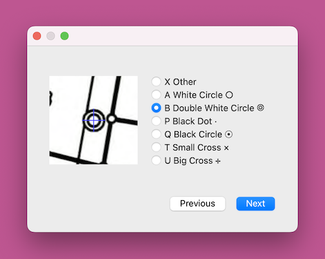

# Corpus Builder



Corpus Builder is an ad-hoc desktop application that was written to
help building the Cadasym image corpus. When the application starts
up, it asks for PDFs with scanned cadastral mutation plans.  After
rendering the selected PDFs to pixel maps, the app uses old-school
Computer Vision to find potential cadastral symbols.  These are
presented to the user, who manually classifies the symbols.  After
manual classification, Corpus Builder stores cropped 256×256 pixel
images in PNG format into the `corpus` folder.


## Setup

```sh
$ git clone https://github.com/brawer/cadasym.git
$ cd cadasym
$ python3 -m venv venv
$ ./venv/bin/pip3 install -r requirements.txt
$ ./venv/bin/python3 -m corpus_builder
```

## License

Copyright 2024 by Sascha Brawer, released under the
[MIT license](https://github.com/brawer/cadasym/blob/main/LICENSES/MIT.txt).


